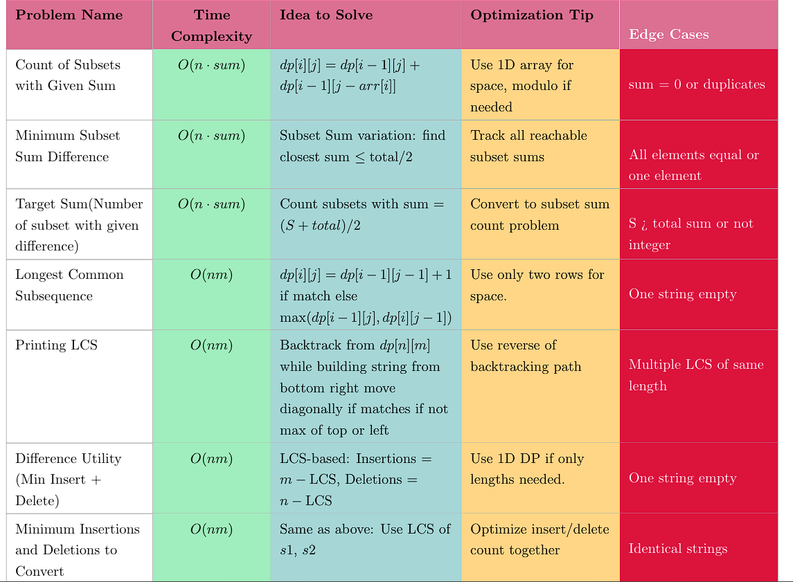
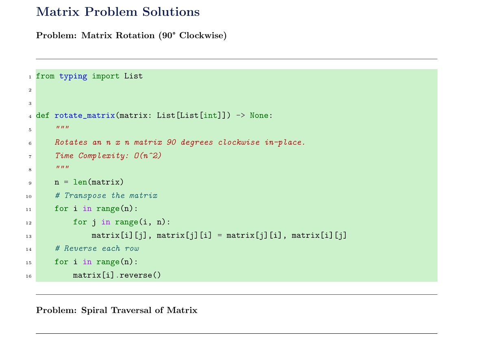

# AlgoHandBook

AlgoHandBook is a comprehensive collection of algorithms and data structures, designed to serve as a reference and learning resource for students, developers, and interview preparation. The project provides clear explanations, well-documented code samples, and practical use cases for a wide range of algorithms.

## Table of Contents

- [Features](#features)
- [Project Structure](#project-structure)
- [Sources Covered](#algorithms-covered)
- [Contributing](#contributing)

## 🪶Features

- Essential Concepts of each of different topics in Data Structures and Algorithms
- List of algorithms Problems with solving Idea ,Optimization Tips and Edge Cases

- Explanations and time/space complexity analysis

- Code samples in Python programming languages along with basics of Python and Data Structures Implementation in it

- Easy to navigate and extend

- Downloadable PDF version of the book

- Consize Theory 


- Problem-solving strategies and tips


- Code samples with explanations



You can  download the pdf of this book at 

```
https://shahir-habib.github.io/DSA_Handbook/book.pdf
```
## 📈Project Structure

```
AlgoHandBook/
│
├── docs/
│   ├── book.pdf(Can Download from here also )
├── solutions/
│   ├── arrays.tex
│   ├── backtracking.tex
│   ├── binary_search.tex
│   ├── bits.tex
│   ├── bst.tex
│   ├── dp.tex
│   ├── graphs.tex
│   ├── greedy.tex
│   ├── hashing.tex
│   ├── heap.tex
│   ├── linked_lists.tex
│   ├── maths.tex
│   ├── matrix.tex
│   ├── queues.tex
│   ├── recursion.tex
│   ├── sorting.tex
│   ├── stack.tex
│   ├── strings.tex
│   ├── trees.tex
│   └── tries_bxt.tex
├── main.tex
├── README.md
└── ...
```

## 📚Sources Covered

LeetCode problems 

Leetcode Blind 75 and other sheets

Geeks for Geeks practice problems


Striver A2Z sheet

Crack the Coding Interview Book


and other algorithmic challenges 
are covered in this repository. Each algorithm is explained with its implementation and complexity analysis.

## 🙌Contributing

Contributions are welcome! Please follow the format before submitting pull requests.

1. Fork the repository
2. Create a new branch
3. Add your algorithm or improvement
4. Submit a pull request

Happy coding and learning!